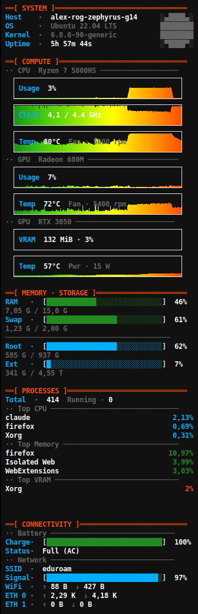

# conky-pixel-theme

A pixel-art retro system monitor for conky, built around the dark theme from [alex-pv01.github.io](https://alex-pv01.github.io/).



## Color palette

| Role | Color |
|---|---|
| Background | `#111111` |
| Primary text | `#e0e0e0` |
| Section headers | `#FF4F00` (orange) |
| Labels / bars | `#00b0ff` (blue) |
| Memory / battery | `#228B22` (green) |
| Secondary text | `#666666` (gray) |
| Key values | `#ffffff` (white) |

## Sections

- **SYSTEM** — hostname, OS, kernel, uptime
- **COMPUTE** — CPU usage/clock/temp graphs, GPU usage/VRAM/temp graphs
- **MEMORY · STORAGE** — RAM, swap, root disk, optional external drive
- **PROCESSES** — top 3 by CPU, memory, and GPU VRAM
- **CONNECTIVITY** — battery, WiFi signal/speed, ethernet links

## Requirements

```bash
sudo apt install conky-all iw lsb-release   # Debian/Ubuntu
sudo pacman -S conky iw                     # Arch
```

For NVIDIA GPU support: `nvidia-smi` must be available (installed with the driver).

## Install

```bash
git clone https://github.com/YOUR_USERNAME/conky-pixel-theme.git
cd conky-pixel-theme
bash setup.sh
pkill conky; conky &
```

`setup.sh` will auto-detect your hardware and ask one question (external drive mount path). It installs to `~/.config/conky/` and creates a GNOME autostart entry.

## What setup.sh detects automatically

| Thing | How |
|---|---|
| CPU model & boost frequency | `/proc/cpuinfo`, `cpuinfo_max_freq` |
| CPU temp sensor | hwmon driver name (`k10temp` / `coretemp`) |
| Fan controller | hwmon driver name (`asus`, `thinkpad`, `dell_smm`, …) |
| AMD GPU | sysfs `gpu_busy_percent` presence |
| NVIDIA GPU | `nvidia-smi` query |
| GPU type | AMD only / NVIDIA only / hybrid / none |
| WiFi interface | `iw dev` |
| Ethernet interfaces | `/sys/class/net/` (up to 2) |
| OS name | `lsb_release` / `/etc/os-release` |

## Manual tweaks that may be needed

| Issue | Where to fix |
|---|---|
| Fan RPM shows 0 or wrong | Check `fan1`/`fan2` input numbers in `~/.config/conky/conky.conf` |
| Wrong CPU/GPU temp | Verify hwmon index via `sensors` or `for d in /sys/class/hwmon/hwmon*/; do echo "$d: $(cat $d/name)"; done` |
| External drive not shown | Re-run `setup.sh` and enter the mount path |
| AMD GPU card index wrong | Check `/sys/class/drm/card*/device/gpu_busy_percent` manually |

## File structure

```
~/.config/conky/
├── conky.conf      ← generated by setup.sh
├── bars.lua        ← generated by setup.sh
├── top_gpu.py      ← top processes by VRAM (NVIDIA or AMD)
└── autostart → ~/.config/autostart/conky.desktop
```

## Ideas / future work

See [IDEAS.md](IDEAS.md).
